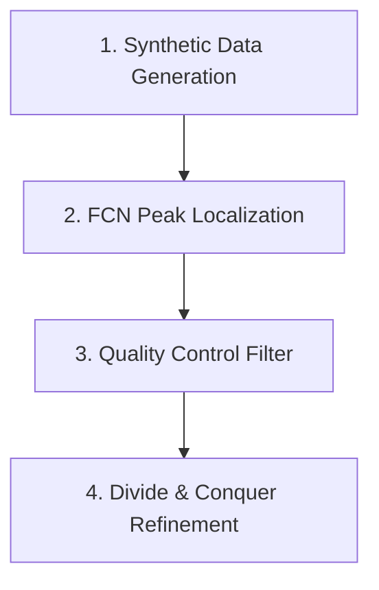

# Physics-Informed Raman Peak Detection & Refinement Pipeline

A physics-informed deep learning and non-linear optimization pipeline designed for automated peak localization, false-positive filtering, and physical parameter estimation in Raman spectroscopy.

The framework pairs a **1D Fully Convolutional Network (FCN) dense detector** (inspired by single-stage object detectors like YOLO and SSD) with **warm-started classical non-linear least-squares curve fitting** using Pseudo-Voigt lineshapes.

---

## 1. Architectural Overview & Physics Motivation

The pipeline processes raw spectra through a four-stage hybrid architecture, decoupling peak localization from non-linear physics refinement. 



Note: For a deep dive into the tensor shapes, loss functions, and optimization algorithms at each stage, see the [Detailed Architecture Diagram](./doc/architecture.md).

### Core Design Philosophy

1. **1D YOLO-Style Dense Detection**:
   Peak detection is framed as a 1D spatial object detection problem. The convolutional trunk downsamples the spectrum into spatial grid cells, predicting peak existence, sub-grid offset corrections, amplitudes, and linewidths concurrently. This eliminates permutation ambiguity and the variable peak-count problem inherent in standard feedforward networks.
2. **Lorentzian Proxy Training Strategy**:
   True Raman peaks exhibit Voigt profiles (a convolution of instrumental Gaussian broadening and natural Lorentzian lifetime broadening). Direct regression of Voigt parameters suffers from severe degeneracy between Gaussian width ($\sigma$) and Lorentzian fraction ($\eta$). Training the FCN strictly on analytical **Lorentzians** decouples **localization** from **lineshape physics**.
3. **Fixed-Threshold Signal Quality Control**:
   Before initiating non-linear optimization, candidate detections are checked against the raw signal using a dual-window Savitzky-Golay smoothing difference ($I_{\text{diff}} = (\text{smooth}_{\text{short}} - \text{smooth}_{\text{long}})^2 \times \text{scale}$). Flat noise regions produce near-zero $I_{\text{diff}}$, while real spectral structure spikes. This currently relies on a **fixed, manually-tuned threshold** rather than an adaptive one — see Section 2 and Section 7.
4. **Direct Raw-Signal Divide-and-Conquer Refinement**:
   While pre-smoothing is optionally used to stabilize initial FCN peak detection, non-linear least-squares refinement is performed **directly against the unaltered resampled raw signal** to preserve physical lineshape amplitudes, widths, and wing decay. The pipeline partitions spectra into natural "islands" based on linewidth-aware separation thresholds and baseline dips, fitting each sub-region with `scipy.optimize.least_squares` (Trust Region Reflective algorithm) warm-started with FCN predictions.

---

## 2. Current Assumptions & Limitations

> [!WARNING]
> **Baseline & Background Handling**: The current pipeline is designed and calibrated for **clean backgrounds and simple baselines** (flat zero-background or low-order linear/polynomial drift).
>
> * **Autofluorescence**: If your experimental spectra contain strong, non-linear autofluorescence backgrounds (which can be 10x–100x stronger than the Raman signal), apply standard baseline subtraction (**AirPLS**, **Asymmetric Least Squares (AsLS)**, or rolling-ball filtering) *prior* to passing spectra into the FCN.
> * **Noise Filtering**: The Savitzky-Golay $I_{\text{diff}}$ check (Section 1, item 3) rejects candidate detections using a **fixed threshold**, not an adaptive one — it is not automatically robust across differing noise levels.
> * **Peak Overlap & Grid Resolution Limit**: Two peaks closer together than roughly one downsampled grid cell width ($\sim 1.6 \text{ cm}^{-1}$ under default settings) or the NMS suppression threshold will be detected as a single combined peak.

---

## 3. Repository Structure

```
modular_fcn/
├── configs.py                            # Central configuration for data, grids, models, and training
├── main.py                               # Unified training + hard-negative-mining retraining pipeline (CLI)
├── README.md                             # Repository overview and documentation
├── docker_torch.sh                       # Docker GPU execution script (with port 8501:8501 forwarding)
├── docker_torch_first.sh                 # Docker initial setup script
│
├── app/                                  # Interactive Streamlit Web GUI
│   ├── app.py                            # UI presentation layer (widgets, controls, layout)
│   └── pipeline.py                       # Decoupled inference, preprocessing & curve fitting backend
│
├── doc/                                  # Extended technical documentation
│   ├── architecture.md                   # Detailed tensor shapes, loss formulations & architecture
│   └── app.md                            # Comprehensive Web GUI user manual & workflow guide
│
├── src/                                  # Core deep learning and physics modules
│   ├── lineshapes.py                     # Analytical lineshapes (Lorentzian, Voigt, Pseudo-Voigt, Gaussian)
│   ├── signal_sample_module.py           # Synthetic spectrum generator with Poisson noise & clusters
│   ├── features.py                       # Multi-channel feature engineering (Savitzky-Golay 2nd deriv, SVD)
│   ├── models_peak_predict.py            # DenseDetector PyTorch 1D FCN model
│   ├── training.py                       # Target builder, masked multi-task loss, and training loop
│   ├── validation.py                     # Greedy peak matching, diagnostic validation, and hard mining
│   └── inference.py                      # Model loading, grid decoding, width-aware NMS, resampling
│
├── processing/                           # Post-processing, classical fitting, and visualization
│   ├── peak_filters_by_raw_signal.py     # Dual-window Savitzky-Golay noise filtering
│   ├── refinement_fit.py                 # Regional bounded Pseudo-Voigt curve fitting & baseline estimation
│   └── plotting.py                       # Spectrum reconstruction, component decomposition, and residual plotting
│
├── saved_models/
│   ├── dense_model.pt                    # Serialized PyTorch model weights
│   └── dense_model_config.json           # Model and grid configuration JSON
│
├── data/
│   └── experiment_1/                     # Experimental Raman text files (VH.txt, VV.txt)
│
└── notebooks/                            # Interactive analysis & validation notebooks
    ├── validate.ipynb                    # Quantitative validation & hard-negative dataset export
    ├── post_training_analysis.ipynb      # Synthetic stress testing (clusters & resolution limits)
    ├── peak_detection_fcn_curvefit.ipynb # Single-spectrum end-to-end detection & refinement demo
```

---

## 4. Quickstart & Workflows

### 4.1. Environment Setup (Docker Workflow)
   The project uses a two-stage GPU-enabled Docker workflow based on NVIDIA PyTorch images:
#### 4.1.1. Initial Setup & Image Customization (First Time Only)
Launch the base NVIDIA container using docker_torch_first.sh:
```bash
bash docker_torch_first.sh
```
Inside the container, install CUDA-enabled PyTorch and project dependencies. Then, from the host machine, commit the configured container to a persistent image named `torch_ml_rapids`:
```
# From host terminal:
docker commit torch_ml torch_ml_rapids
```
#### 4.1.2. Standard Daily Execution
  For all subsequent runs, launch interactive GPU sessions using docker_torch.sh, which mounts your workspace and Hugging Face / cache directories to torch_ml_rapids:
```
  bash docker_torch.sh
```

### 4.2. Training the Base Model
`main.py` synthesizes a Poisson-noised spectrum pool, precomputes geometric target grids, trains the `DenseDetector`, evaluates test performance, and (optionally) exports hard-mined failure cases:
```bash
python main.py
```
Outputs:
* `<model_name>.pt` — PyTorch model weights (default `dense_model.pt`)
* `<model_name>_config.json` — Associated grid/data configuration (default `dense_model_config.json`)
* `<export_hard_data>` — Extracted failure cases for retraining, if `--export-hard-data` is set

### 4.3. Retraining with Hard-Negative Mining
The same entry point handles retraining: pass an existing hard-mined `.npz` set via `--hard-data` and it's concatenated onto the base training pool (oversampled by `--oversample`) before training begins:
```bash
python main.py --hard-data hard_mined_v1.npz --oversample 5
```
If `--hard-data` points to a file that doesn't exist, the script logs a warning and falls back to base training rather than failing.

### 4.4. CLI Reference
`main.py` exposes the run-level knobs from `TrainConfig` (epochs, batch size, learning rate, dataset sizes, model name, hard-data path/oversample factor, seed). Structural data/physics parameters (`amp_range`, `gamma_range`, `K`, `sandwiched_prob`, `N_INPUT_CHANNELS`, etc.) live on `Config` and are still edited in `configs.py`.

```bash
python main.py \
  --epochs 150 \
  --lr 1e-3 \
  --batch-size 64 \
  --n-train 60000 --n-val 5000 --n-test 5000 \
  --model-name dense_model \
  --hard-data hard_mined_v1.npz --oversample 5 \
  --export-hard-data hard_mined_v2.npz \
  --seed 0
```

### 4.5. Interactive Web Application (Streamlit)
An interactive web GUI is available for drag-and-drop experimental spectrum analysis, real-time FCN peak localization, on-demand Pseudo-Voigt fitting, and parameter CSV export.

```bash
# Launch the Streamlit application
streamlit run app/app.py
```

* **Docker Execution**: When running inside the Docker container (`docker_torch.sh`), host port `8501` is forwarded by default. Open `http://localhost:8501` in your browser.
* **Detailed Documentation**: For a full breakdown of GUI controls, pre-smoothing filters, and visualization settings, refer to the [Streamlit GUI Guide](./doc/app.md).

---

## 5. Interactive Notebook Guide

The [`notebooks/`](file:///home/phchang/AI_space_sync/raman_peaks_detection/modular_fcn/notebooks) directory provides modular, self-contained workflows:

| Notebook                                                                                                                                                    | Focus / Description                                                                                                                                                                                              |
| :---------------------------------------------------------------------------------------------------------------------------------------------------------- | :--------------------------------------------------------------------------------------------------------------------------------------------------------------------------------------------------------------- |
| [**`validate.ipynb`**](file:///home/phchang/AI_space_sync/raman_peaks_detection/modular_fcn/notebooks/validate.ipynb)                                       | Computes quantitative peak-level matching metrics (Precision, Recall, F1) across 8,000 synthetic spectra, analyzes failure modes (grid collisions vs sub-threshold confidence), and exports hard-mined datasets. |
| [**`post_training_analysis.ipynb`**](file:///home/phchang/AI_space_sync/raman_peaks_detection/modular_fcn/notebooks/post_training_analysis.ipynb)           | Evaluates peak-counting accuracy, visualizes multi-peak detection overlays, and conducts physical stress tests against sandwiched clusters and close doublet separation limits.                                  |
| [**`peak_detection_fcn_curvefit.ipynb`**](file:///home/phchang/AI_space_sync/raman_peaks_detection/modular_fcn/notebooks/peak_detection_fcn_curvefit.ipynb) | Step-by-step walkthrough on a real experimental Raman spectrum (`VV.txt`): grid resampling $\to$ FCN detection $\to$ noise rejection $\to$ global / regional Pseudo-Voigt fitting $\to$ residual analysis.       |

---

## 6. Key Module References

* **Web GUI & Pipeline**: [`app/app.py`](file:///home/phchang/AI_space_sync/raman_peaks_detection/modular_fcn/app/app.py), [`app/pipeline.py`](file:///home/phchang/AI_space_sync/raman_peaks_detection/modular_fcn/app/pipeline.py) (see [GUI Guide](./doc/app.md))
* **Lineshapes & Physics**: [`src/lineshapes.py`](file:///home/phchang/AI_space_sync/raman_peaks_detection/modular_fcn/src/lineshapes.py) (`lorentzian_np`, `pseudo_voigt`, `voigt`)
* **Synthetic Generator**: [`src/signal_sample_module.py`](file:///home/phchang/AI_space_sync/raman_peaks_detection/modular_fcn/src/signal_sample_module.py) (`sample_true_peaks`, `generate_sandwiched_cluster`, `poisson_measurement`)
* **FCN Model**: [`src/models_peak_predict.py`](file:///home/phchang/AI_space_sync/raman_peaks_detection/modular_fcn/src/models_peak_predict.py) (`DenseDetector`)
* **Loss Function & Target**: [`src/training.py`](file:///home/phchang/AI_space_sync/raman_peaks_detection/modular_fcn/src/training.py) (`dense_loss` = BCE presence + masked MSE offset/amplitude/gamma)
* **NMS & Grid Decoding**: [`src/inference.py`](file:///home/phchang/AI_space_sync/raman_peaks_detection/modular_fcn/src/inference.py) (`decode_and_nms`, `predict_peaks_dense`, `resample_to_training_grid`)
* **Signal Filter (experimental)**: [`processing/peak_filters_by_raw_signal.py`](file:///home/phchang/AI_space_sync/raman_peaks_detection/modular_fcn/processing/peak_filters_by_raw_signal.py) (`filter_by_raw_signal`, `filter_by_raw_signal_flat`, `compute_i_diff`)
* **Non-Linear Refinement**: [`processing/refinement_fit.py`](file:///home/phchang/AI_space_sync/raman_peaks_detection/modular_fcn/processing/refinement_fit.py) (`refine`, `refine_grouped`, `partition_peaks`)
* **Plotting & Diagnostics**: [`processing/plotting.py`](file:///home/phchang/AI_space_sync/raman_peaks_detection/modular_fcn/processing/plotting.py) (`plot_reconstruction`)

---

## 7. Future Roadmap

*   **Automated False-Positive Rejection:** Currently, noisy predictions are filtered using a hardcoded, multi-scale smoothing check. The next step is to replace this with a lightweight ML classifier (e.g., XGBoost) that evaluates local signal-to-noise ratios and peak spacing. To train this, the synthetic data generator will be upgraded to include complex, wavy baselines, allowing the pipeline to adapt to varying noise floors without manual threshold tuning.
*   **Algorithmic Baseline Correction:** Native integration of automated background subtraction algorithms directly into the data pre-processing pipeline to handle severe instrument noise.
*   **Multichannel FCN Inputs:** Feeding signal derivatives alongside the raw data into the neural network to improve feature extraction and detection in dense, overlapping regions.
*   **Batch Acceleration for 2D Grids:** Scaling the divide-and-conquer optimization engine to efficiently process massive datasets in parallel, such as 100x100 spatial mapping grids.
