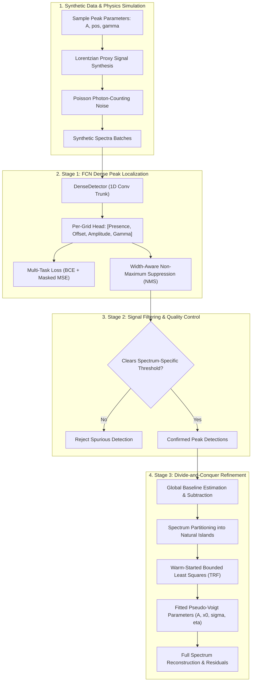

# Detailed Architecture Diagram

```mermaid
flowchart TD
    subgraph DataGen ["1. Synthetic Data & Physics Simulation"]
        A[Sample Peak Parameters: A, pos, gamma] --> B[Lorentzian Proxy Signal Synthesis]
        B --> C[Poisson Photon-Counting Noise]
        C --> D[Synthetic Spectra Batches]
    end

    subgraph DL_Stage ["2. Stage 1: FCN Dense Peak Localization"]
        D --> E["DenseDetector (1D Conv Trunk)"]
        E --> F["Per-Grid Head: [Presence, Offset, Amplitude, Gamma]"]
        F --> G["Multi-Task Loss (BCE + Masked MSE)"]
        F --> H["Width-Aware Non-Maximum Suppression (NMS)"]
    end

    subgraph QC_Stage ["3. Stage 2: Signal Filtering & Quality Control"]
        H --> J{Clears Spectrum-Specific Threshold?}
        J -- No --> K[Reject Spurious Detection]
        J -- Yes --> L[Confirmed Peak Detections]
    end

    subgraph Fit_Stage ["4. Stage 3: Divide-and-Conquer Refinement"]
        L --> M["Global Baseline Estimation & Subtraction"]
        M --> N["Spectrum Partitioning into Natural Islands"]
        N --> O["Warm-Started Bounded Least Squares (TRF)"]
        O --> P["Fitted Pseudo-Voigt Parameters (A, x0, sigma, eta)"]
        P --> Q["Full Spectrum Reconstruction & Residuals"]
    end
```

